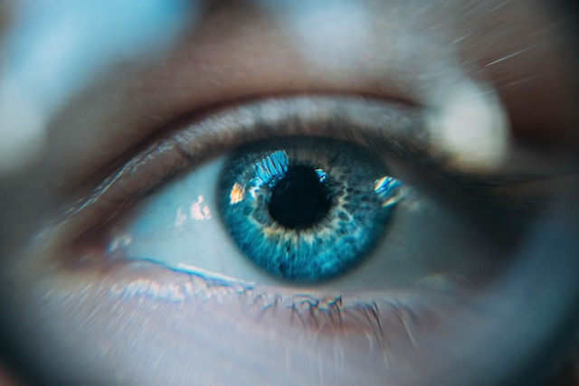

<!-- PROJECT LOGO -->
<br />
<div align="center">
  

  <h1 align="center">IRIS DETECTION</h1>

  <p align="center">
    <em>Application permettant l'identification d'un employé en fonction de son iris de l'oeil droit ou gauche.</em>
  </p>
</div>
<br>

## LE PROJET

### IA pour la reconnaissance d'iris

En tant que développeur IA, votre entreprise vous a confié la mission de développer une interface de
reconnaissance d’œil pour une entreprise souhaitant authentifier ses 45 employés à partir d’un scan de leurs
yeux. Un employé avait déjà travaillé sur ce projet et vous livre la base de données, ainsi que son notebook
qui avait permis la préparation de sa base de données et l’entrainement d’un modèle à l’authentification d’un
employé à partir de l’image d’œil gauche. Aussi, cet employé avait récupéré le modèle entrainé dans une
application de prédiction qu’il avait développé en tkinter. Cependant, des problèmes subsistent : le modèle
n'atteint pas les performances optimales, l'interface utilisateur manque d'ergonomie et se limite uniquement
à la prédiction à partir des images d'yeux gauches. En outre, les prédictions actuelles fournissent les
probabilités d'appartenance à chaque employé plutôt que l’identifiant respectif et les informations
personnelles.

<br>

### Outils de conception

* Python
* TensorFlow
* Scikit-Learn
* Tkinter
* Streamlit

<br>

## Éléments à disposition

1. Jeu de données
    - 45 sous-dossiers correspondant à l'identifiant de chaque employé (de 1 à 46, excluant 4).
    - Dans chacuns de ces 45 dossiers se trouvent deux répertoires, un pour l'oeil droit 'right' et un pour l'oeil gauche 'left'.
2. Un fichier JSON '[employees_info.json](employees_info.json)', stockant les informations de chaque employé (pour chaque ID, on trouve : nom, date_embauche, genre, poste).
3. Un notebook d'entraînement : il fournit les étapes détaillées de la préparation des données et de l'entraînement du modèle pour la reconnaissance de l'oeil gauche.
4. Une application Tkinter permettant l'authentification de l'oeil gauche.<br>

Tous ces éléments se trouvent dans le dossier '[code_origin](code_origin)'.

<br>

## Cahier des charges

1. Améliorer le programme d’IA existant pour permettre la bonne classification d’un employé à partir
d’un scan d’un de ses yeux (droit ou gauche).
2. Développer une application conviviale qui réalise les tâches suivantes :
    - Permettre le téléchargement d'une image de l'œil d'un employé.
    - Afficher l'image téléchargée
    - Prédire si l'œil est gauche ou droit.
    - Authentifier l'employé en utilisant le classifieur approprié en fonction de la prédiction
précédente et en affichant les informations de la personne authentifiée.

<br>

## Installation

1. Créez un dossier 'Projet' et son environnement virtuel
2. Placez-vous dans le dossier 'Projet' et activez son environnement virtuel
3. Récupérez le dépôt via Git et la commande 'git clone' suivante :
   ```sh
   git clone https://github.com/antancelin/cas_pratique_PCO
   ```
4. Installez les packages via le fichier '[requirements.txt](requirements.txt)' :
   ```sh
   pip install -r requirements.txt
   ```
5. Pour lancer l'application Streamlit :
   ```sh
   streamlit run app_streamlit.py
   ```
6. Pour lancer l'application Tkinter :
   ```sh
   python (or python3) app_tkinter.py
   ```

<br>

## Contact

Antoine Ancelin - LinkedIn : [@antancelin](https://www.linkedin.com/in/antancelin/) - Mail : ancelin.ant@gmail.com

Lien du projet : [https://github.com/antancelin/cas_pratique_PCO](https://github.com/antancelin/cas_pratique_PCO)

<p align="right">(<a href="#readme-top">Retour en haut de page</a>)</p>